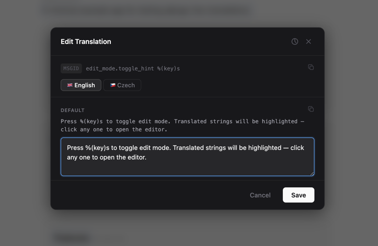

# django-live-translations

[](https://github.com/VojtechPetru/django-live-translations/actions/workflows/ci.yml)
[](https://www.python.org/downloads/)
[](https://www.djangoproject.com/)
[](https://vojtechpetru.github.io/django-live-translations/)

**In-browser translation editing for Django superusers.**

Edit translations directly on any page of your Django application. Toggle edit mode, click any translatable string, and save changes that take effect immediately - no deployment, no restarts, no context switching to `.po` file editors.

<div align="center">
  
</div>

## Features

- **Inline editing** - click any translatable string to open a multi-language editor
- **Live preview** - changes appear on the page instantly after saving
- **Preview mode** - review inactive translations before making them live
- **Draft language support** - prepare translations for unpublished languages before going live
- **Edit history** - word-level diffs with one-click restore
- **Bulk activation** - select and activate multiple pending translations at once
- **Two storage backends** - PO files (default) or database with cache-based sync
- **Custom permissions** - control who can edit with a simple callable
- **Django admin integration** - manage translation overrides from the admin panel
- **Zero frontend dependencies** - vanilla JS widget, no build step required

<div align="center">
  
</div>

## Quick start

```bash
pip install django-live-translations
# or
uv add django-live-translations
# or
poetry add django-live-translations
```

```python
# settings.py
INSTALLED_APPS = [
    # ...
    "django.contrib.staticfiles",
    "live_translations",
]

MIDDLEWARE = [
    # ...
    "django.contrib.auth.middleware.AuthenticationMiddleware",
    "live_translations.middleware.LiveTranslationsMiddleware",  # after auth
    # ...
]
```

Log in as a superuser and press <kbd>Ctrl</kbd>+<kbd>Shift</kbd>+<kbd>E</kbd> to activate edit mode.

For the full setup guide, see the [documentation](https://vojtechpetru.github.io/django-live-translations/).

## Demo app

The repository includes a working example app:

```bash
git clone https://github.com/vojtechpetru/django-live-translations
cd django-live-translations
pip install -e ".[dev]"
cd example
python manage.py migrate
python manage.py runserver
```

Open [localhost:8000](http://localhost:8000) and click "Quick Login" to auto-create a superuser.

## Compatibility

| Python | Django |
|--------|--------|
| 3.12, 3.13, 3.14 | 4.2, 5.0, 5.1, 5.2, 6.0 |

## Contributing

Contributions are welcome! Here's how to get started:

### Setup

```bash
git clone https://github.com/vojtechpetru/django-live-translations
cd django-live-translations
uv sync --all-extras
pre-commit install
```

### Development commands

This project uses [just](https://github.com/casey/just) as a task runner:

```bash
just unit          # run unit tests
just e2e           # run e2e tests (both backends)
just e2e-po        # run e2e tests (PO backend only)
just e2e-db        # run e2e tests (DB backend only)
just bench         # run performance benchmarks
just demo          # start the example app
just docs-serve    # serve docs locally
```

### Code quality

The project enforces strict quality standards through pre-commit hooks and CI:

- **Formatting**: `ruff format` (120 char line length)
- **Linting**: `ruff check`
- **Type checking**: `pyrefly`
- **Test coverage**: 90%+ required
- **Test suite**: 650+ unit tests, 290+ Playwright e2e tests

### Pull requests

1. Fork the repo and create your branch from `main`
2. Add tests for any new functionality
3. Ensure `just test` passes and coverage stays above 90%
4. Make sure pre-commit hooks pass (`ruff`, `pyrefly`)
5. Open a pull request with a clear description of the change


