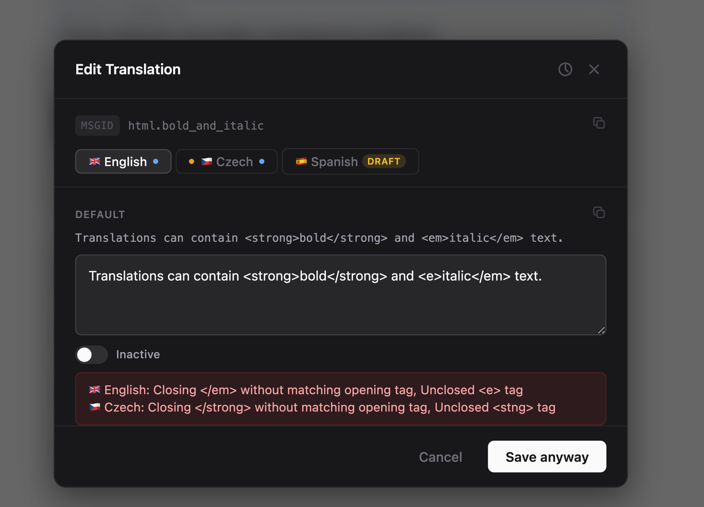
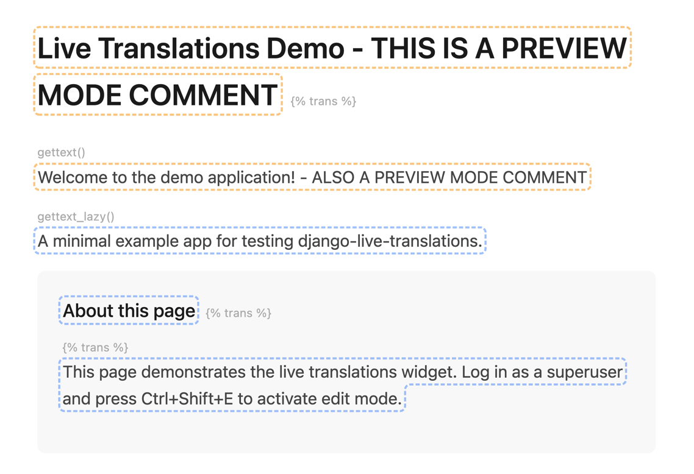
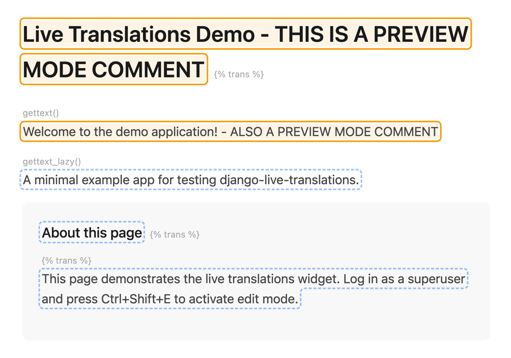
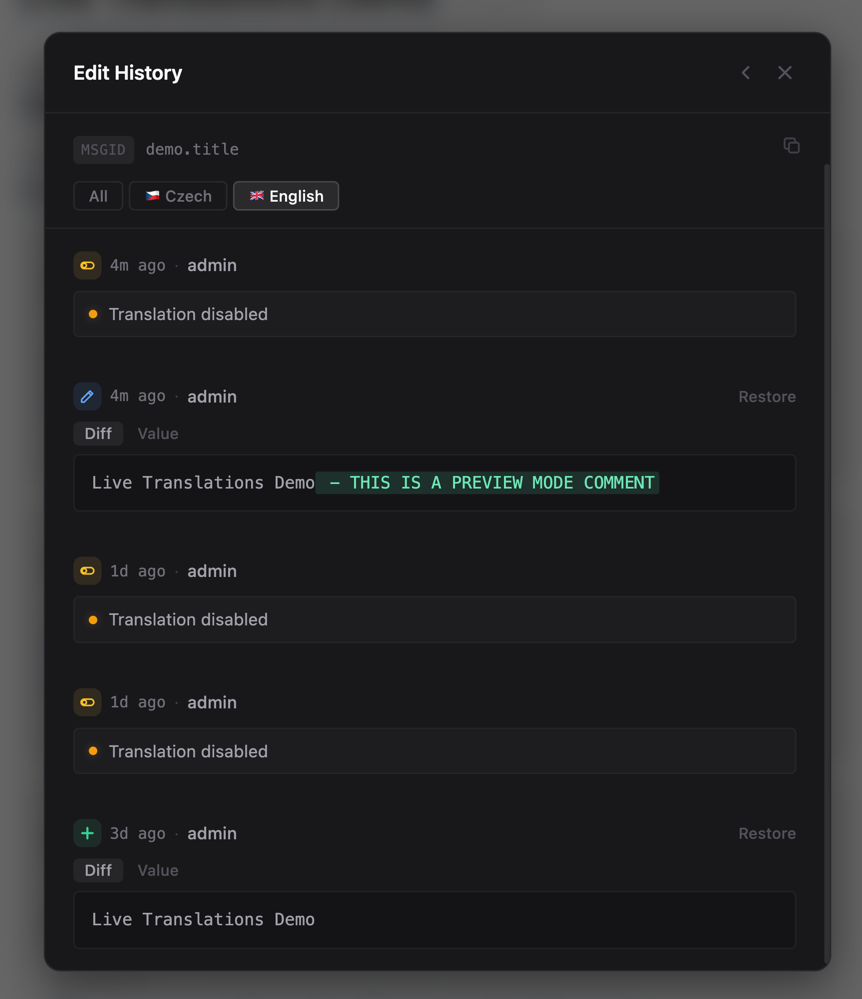
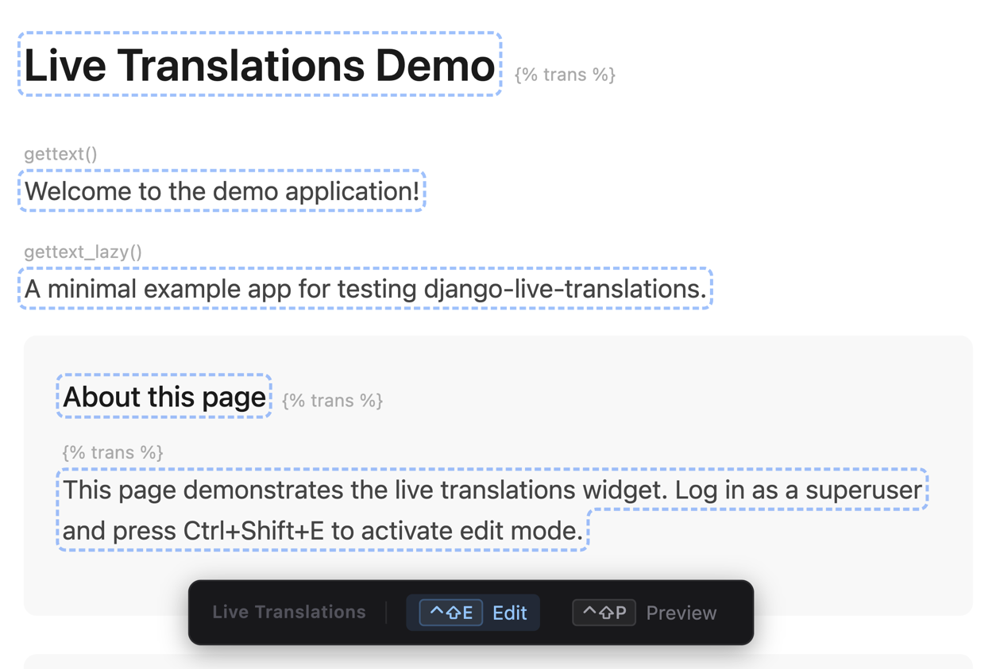
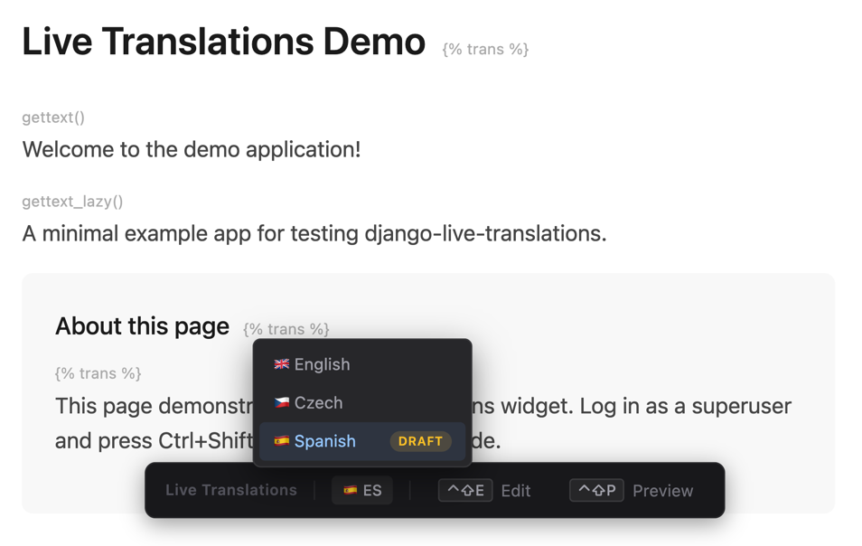

# Editing Translations

This page covers the full editing workflow: toggling edit mode, using the modal editor, previewing changes, and working with history.

## Edit mode

Press ++ctrl+shift+e++ (or your [configured shortcut](configuration.md)) to toggle edit mode. All translatable strings on the page get highlighted with blue dashed outlines.

{ loading=lazy }
/// caption
Translatable strings highlighted in edit mode.
///

Click any highlighted string to open the editor modal. Press ++escape++ or click outside the modal to close it. Press ++escape++ again to exit edit mode entirely.

## The editor modal

The modal provides a tabbed editor with one tab per configured language.

{ loading=lazy }
/// caption
The multi-language editor modal.
///

Each language tab shows:

- **Textarea** for editing the translation
- **PO file default** (read-only) showing the baseline value from the `.po` file
- **Translator hint** extracted from `.po` file comments (`#.` lines), when available
- **Active/inactive toggle** controlling whether this translation is live

The modal header displays the original `msgid` with a copy button.

### Saving

Click **Save** to persist changes across all tabs. On save:

1. The backend stores the translations (to `.po` files or database, depending on your [backend](backends.md))
2. The page updates in real-time to reflect the new translation, no reload needed
3. The action is recorded in [edit history](#edit-history)

### Deleting an override

Click **Delete Override** to revert a language to its `.po` file default. This removes the database entry (DB backend) or the pending override comment (PO backend).

### Validation

The editor validates translations before saving. Two types of validation run:

**Placeholder validation** checks that format strings like `%(name)s` and `{name}` match between the original `msgid` and each translation. This is enforced server-side. Mismatched placeholders block the save.

**HTML structure validation** checks for unclosed, mismatched, or stray tags in translations that contain HTML. This is client-side only and non-blocking.

{ loading=lazy }
/// caption
HTML validation warns about tag issues but allows saving with "Save anyway".
///

When HTML issues are detected, the Save button changes to **Save anyway**. Editing the textarea clears the warning.

!!! tip
    HTML validation is a convenience to catch typos, not a security boundary. Translators are trusted users who may intentionally use unconventional markup.

## Preview mode

Press ++ctrl+shift+p++ to toggle preview mode. This overlays inactive translations on the page with amber borders, letting you review pending changes before activating them.

{ loading=lazy }
/// caption
Inactive translations shown with amber borders in preview mode.
///

Preview mode is gated by the same [permission check](permissions.md) as edit mode.

## Bulk activation

In preview mode, you can activate multiple translations at once:

1. Enter preview mode (++ctrl+shift+p++)
2. Hold ++shift++ and click on inactive translations to select them
3. A floating action bar appears with the count and an "Activate" button
4. Click **Activate** to make all selected translations live

{ loading=lazy }
/// caption
Selecting translations for bulk activation in preview mode.
///

## Edit history

The editor modal includes a history panel showing all previous edits for the current string.

{ loading=lazy }
/// caption
Edit history with word-level diffs and restore buttons.
///

Each history entry shows:

- Timestamp and the user who made the change
- Action type: create, update, delete, activate, or deactivate
- Word-level diff highlighting additions and deletions
- **Restore** button to revert to that value

History is stored in the `TranslationHistory` database table and is available with both backends. If the table doesn't exist (migrations not run), history is silently skipped.

## Hint bar

A draggable bar appears at the bottom of the page showing available keyboard shortcuts. Drag it to reposition. Its position is saved to `localStorage` and persists across page loads.

{ loading=lazy }
/// caption
The hint bar shows available keyboard shortcuts.
///

## Language switcher

When multiple languages are configured, the hint bar includes a language dropdown.

{ loading=lazy }
/// caption
Language switcher with a draft language marked.
///

Switching behavior depends on the language type:

- **Published languages**: navigates to the language-prefixed URL (e.g. `/de/about/`) if `i18n_patterns` is detected, or sets the `django_language` cookie and reloads
- **Draft languages**: sets a cookie override (`lt_lang`) and reloads. The middleware renders the page in the draft locale without URL changes.

[Draft languages](configuration.md#draft-languages) are marked with an amber "Draft" badge.

## Keyboard shortcuts

| Shortcut | Action | Configurable |
|----------|--------|:------------:|
| ++ctrl+shift+e++ | Toggle edit mode | Yes |
| ++ctrl+shift+p++ | Toggle preview mode | Yes |
| ++escape++ | Close modal or exit edit mode | No |
| ++shift++ + click | Select for bulk activation (preview mode) | No |
