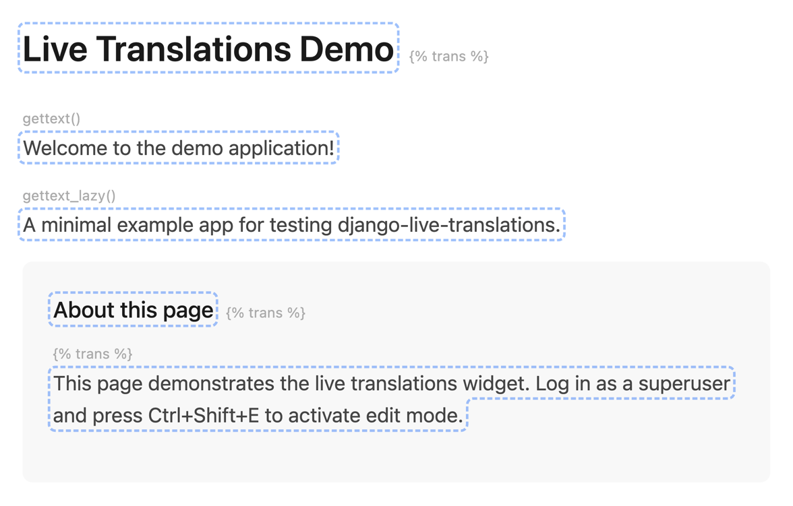

# Getting Started

## Installation

Install the package from PyPI:

=== "uv"

    ```bash
    uv add django-live-translations
    ```

=== "poetry"

    ```bash
    poetry add django-live-translations
    ```

=== "pip"

    ```bash
    pip install django-live-translations
    ```

## Setup

### 1. Add to installed apps

```python
INSTALLED_APPS = [
    # ...
    "django.contrib.staticfiles",  # required for widget assets
    "live_translations",
]
```

!!! note
    `django.contrib.staticfiles` must be in `INSTALLED_APPS` for the widget's CSS and JavaScript to be served. A system check warning (`live_translations.W001`) is raised if it's missing.

### 2. Add the middleware

Add `LiveTranslationsMiddleware` to your `MIDDLEWARE` setting **after** `AuthenticationMiddleware`:

```python
MIDDLEWARE = [
    # ...
    "django.contrib.sessions.middleware.SessionMiddleware",
    "django.middleware.locale.LocaleMiddleware",
    "django.contrib.auth.middleware.AuthenticationMiddleware",
    "live_translations.middleware.LiveTranslationsMiddleware",  # <--
    # ...
]
```

!!! warning
    The middleware must come **after** `AuthenticationMiddleware` because it needs access to `request.user` to check permissions.

### 3. Run migrations (database backend only)

If you plan to use the database backend, run migrations to create the required tables:

```bash
python manage.py migrate
```

This creates the `TranslationEntry` and `TranslationHistory` tables. If you're using the default PO file backend, this step is optional (the history table is only used by the database backend).

### 4. Configure (optional)

The default configuration works out of the box for most projects. Add `LIVE_TRANSLATIONS` to your settings only if you need to customize behavior:

```python
LIVE_TRANSLATIONS = {
    "LANGUAGES": ["en", "cs", "de"],
    "LOCALE_DIR": BASE_DIR / "locale",
}
```

See the [Configuration](configuration.md) page for all available options.

## Verify it works

1. Log in as a superuser
2. Navigate to any page that uses `` or `gettext()` strings
3. Press `Ctrl+Shift+E` to toggle edit mode
4. Translatable strings will be highlighted with blue dashed outlines

<!-- TODO: replace with actual screenshot -->
{ loading=lazy }
/// caption
Edit mode activated with translatable strings highlighted
///

Click any highlighted string to open the translation editor.

## Try the demo app

The repository includes a working example app you can run locally to see the package in action:

```bash
git clone https://github.com/vojtechpetru/django-live-translations
cd django-live-translations
pip install -e ".[dev]"
cd example
python manage.py migrate
python manage.py runserver
```

Open [localhost:8000](http://localhost:8000) and click the "Quick Login" button - it creates a superuser automatically. Then press `Ctrl+Shift+E` to start editing translations. The demo is configured with the PO backend and English/Czech languages.

## Next steps

- [Configuration](configuration.md) - customize settings
- [Backends](backends.md) - choose between PO files and database storage
- [Permissions](permissions.md) - control who can access the editing UI
