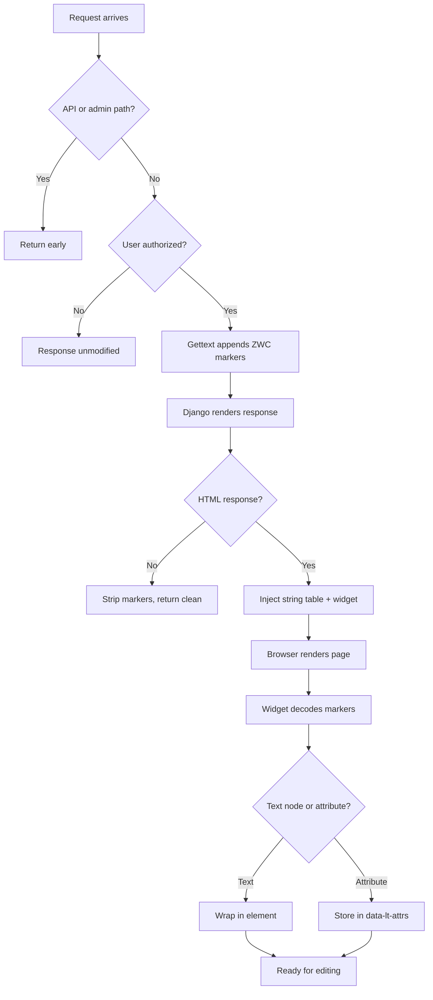

# How It Works

This page documents the technical internals. We believe in being transparent about what the package does to your Django process, especially the parts that rely on monkey-patching and private APIs.

## Request lifecycle



## Gettext monkey-patching

On `AppConfig.ready()`, the package replaces `_trans.gettext`, `_trans.pgettext`, `_trans.ngettext`, and `_trans.npgettext` on Django's internal `django.utils.translation._trans` module.

The patched functions wrap the originals:

- When `lt_active` is `False` (regular users): calls the original function and returns immediately. The overhead is a single `contextvars` lookup.
- When `lt_active` is `True` (authorized users): appends an invisible marker to the translated string before returning.

The middleware sets `lt_active` to `True` only when the request passes the permission check. For regular users, the gettext path is a near-zero-cost pass-through: no markers, no JavaScript, no DOM changes.

Lazy variants (`gettext_lazy`, `pgettext_lazy`, `ngettext_lazy`, `npgettext_lazy`) are covered automatically because their proxies delegate to the corresponding `_trans` functions on evaluation.

!!! warning "Private API dependency"
    `django.utils.translation._trans` is not a public Django API. It has been stable across Django 4.2 through 5.x but could break in a future release. The package tests against all supported Django and Python versions in CI.

## Zero-width character markers

To map rendered strings back to their `msgid`, the patched gettext appends an invisible 18-character marker:

```
U+FEFF + 16 × (U+200B | U+200C) + U+FEFF
```

- `U+FEFF` (byte order mark): boundary delimiter
- `U+200B` (zero-width space): bit `0`
- `U+200C` (zero-width non-joiner): bit `1`
- The 16 bits encode a string-table ID (0 to 65535), a per-request index into the string registry

These characters are invisible in rendered HTML and survive Django's autoescaping, `capfirst`, `html.escape`, and string formatting.

??? info "Where markers can leak"
    The middleware strips markers from non-HTML responses (JSON, plain text) via regex. Markers could theoretically appear in:

    - Cached template fragments rendered for an authorized user
    - Signals or side effects during response rendering
    - Third-party middleware that captures content before `LiveTranslationsMiddleware`

    Position the middleware after any middleware that caches rendered content.

## Middleware processing

`LiveTranslationsMiddleware` has three jobs:

**API dispatch**: requests to `/__live-translations__/*` are routed directly to view functions, bypassing Django's URL resolver. No `urls.py` needed.

**Asset injection**: for HTML responses from authorized users, the middleware injects before `</body>`:

- A `<link>` tag for the widget CSS
- An inline `<script>` containing `window.__LT_CONFIG__` (API base URL, CSRF token, languages, shortcuts) and `window.__LT_STRINGS__` (the per-request string registry mapping marker IDs to msgid/context)
- A `<script>` tag for the widget JavaScript

**Marker stripping**: for non-HTML responses, ZWC markers are removed to prevent leaking into API consumers.

The middleware skips Django admin URLs (`/admin/`) entirely.

## Catalog injection (database backend)

The database backend writes overrides directly into Django's internal translation catalog objects (`DjangoTranslation._catalog`), a dict mapping msgid strings to translations:

```python
# Singular entries:
catalog[msgid] = override_msgstr
# Context-based:
catalog[f"{context}\x04{msgid}"] = override_msgstr

# Plural entries use (key, form_index) tuple keys:
catalog[(msgid, 0)] = "1 item"
catalog[(msgid, 1)] = "%d items"
```

!!! warning "Private API dependency"
    `DjangoTranslation._catalog` and the `\x04` context separator are internal implementation details inherited from GNU gettext. Both have been stable across many Django versions but are not guaranteed.

## Frontend widget

The widget is a single vanilla JavaScript file (~2500 lines, zero dependencies) served as a Django static file. It:

1. Walks the DOM looking for ZWC boundary characters (`U+FEFF`)
2. Decodes the 16-bit ID from the marker sequence
3. Looks up the msgid and context in `window.__LT_STRINGS__`
4. Strips markers and wraps text nodes in `<lt-t>` custom elements

`<lt-t>` is an unknown HTML element that browsers treat as an inline span, with no default styling or shadow DOM. All widget CSS classes are prefixed `.lt-` to avoid conflicts with the host page.

## Performance

| Scenario | Overhead |
|----------|----------|
| Regular user | One `contextvars` lookup per `gettext()` call. DB backend adds one cache read per request. |
| Authorized user, edit mode off | ZWC encoding + string registry per `gettext()`, asset injection on response |
| Authorized user, edit mode on | Same as above, plus client-side DOM walking |
| Database backend, per request | One cache read (`ensure_current()`), occasional full catalog re-injection |

Benchmarks verify runtime overhead stays under 10% for normal users and under 100% for translators. In practice, normal user overhead is 1-2% in pure translation-rendering scenarios.
